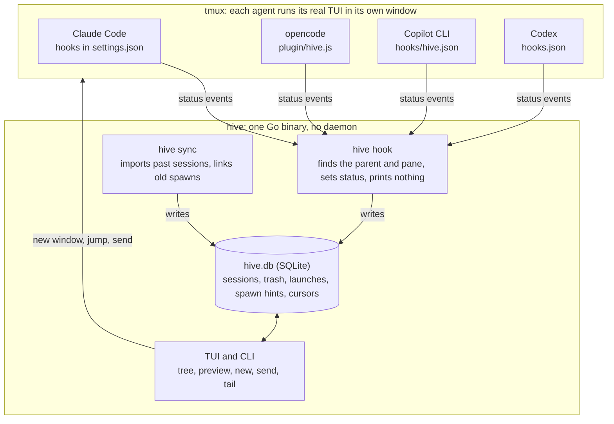

# hive — design

hive is one Go binary that records every Claude Code, opencode, GitHub Copilot CLI and
Codex session, links each agent to the agents it spawns in any direction, and lets you
jump into or command any of them from a single tree. Each agent runs its own real TUI
in a tmux window; hive never wraps or reimplements an agent.

All five build phases shipped on 28–29 September 2026. This file is the living design:
change it in the same commit as the code it describes. The [README](README.md) covers
install and daily use.

## Decisions

Settled before coding started; the Copilot adapter and the config format came later.

| Topic | Decision | Consequence |
| --- | --- | --- |
| Name | `hive` | Binary and private repo `sadrishehu/hive`; data in `~/.local/share/hive` |
| Headless children | Support both | `opencode run`, `claude -p` and `codex exec` stay tracked and watchable; `hive new` adds interactive, jumpable children |
| Host | tmux is a hard dependency | Every agent TUI lives in a tmux window; `hive` outside tmux starts or attaches a `hive` tmux session |
| Tools' own subagents | Shown by default | Claude Task agents, opencode task sessions and Codex's spawned threads appear as children; `i` hides them |
| Popup key | prefix + `a` (Ctrl+b a) | `hive install tmux --key` changes it |
| Needs-you key | prefix + `A` | `hive install tmux --next-key` changes it; it runs `hive jump --next` for the client that pressed it |
| Telling you an agent needs you | a tmux message by default; desktop notifications and the status-line count are opt-in | The hook that records the wait sends it, so there is still no daemon; `hive install` never edits `status-right`, which people style themselves |
| Waiting on agents | `hive wait` polls the database | A message hive gave an agent counts until a turn ending after it, so a `wait` right after `send` never takes the turn before for the reply |
| Spawn direction | Any tool can spawn any tool | One mechanism in the core links every direction; adapters only report |
| Codex | Built once it was installed | Tested live against Codex 0.158; Codex asks once, in an interactive session, to trust new hooks |
| Copilot CLI | Added beyond the first plan | Tracked live through user-level hooks; it has no permission hook, so it never shows "needs you" |
| Config | TOML, `[[agent]]` tables | New tools without Go code; built-in tools changed field by field |
| Deleting | A trash first, then deleting for good through each tool | Nothing is lost by one key press; what is deleted for good goes the way its tool would delete it, so the tool's own lists stay consistent |

## Architecture



- hive never wraps an agent. It starts the real binary in a tmux window and gets out of the way.
- Agents report themselves. Each tool gets a small integration that calls `hive hook <tool>`;
  nothing of hive's runs in the background.
- Tools are adapters. Everything tool-specific sits behind one interface, or a few lines of
  config; linking, liveness, tmux control and the TUI are shared.

## Parent to child linking

Linking lives in the core, so every direction works the same: Claude to opencode, opencode
to Claude, Codex to Claude, and any tool added later. When a session first reports in, its
parent is the first of:

1. the parent the event names: opencode's `parentID`, Claude's and Codex's `SubagentStart`;
2. the launch record for its tmux pane: hive opened that window (`hive new`, `n` / `c` in the
   tree) with the parent it was asked for, by default the agent that ran `hive new`;
3. the nearest ancestor process that is a live session, at any depth and mix of tools;
4. `HIVE_PARENT` from the environment, which survives `nohup` and `setsid`;
5. the tool's own variable: `CLAUDE_CODE_SESSION_ID`, `CODEX_THREAD_ID`.

Ancestry comes before the environment because children inherit variables from further up:
a Claude run inside opencode inside Claude still sees the outer `CLAUDE_CODE_SESSION_ID`.
No match makes the session a root. The parent is written once and checked for cycles. A
parent named only by the environment that hive doesn't track yet is adopted from the
child's nearest ancestor running that tool, so agents started before `hive install` become
tracked as soon as they spawn something.

The same walk up the process tree finds the tmux pane; meeting another agent's process
first means the session runs inside that agent's shell tool, so it is headless. Codex runs
its hooks in its shared `codex app-server` daemon, not under the TUI: hive finds a Codex
TUI through the window it opened for it, or as the only Codex TUI in that folder.

| Tool | Reports itself | Marks its children | Past spawns found in |
| --- | --- | --- | --- |
| Claude Code | hooks in `~/.claude/settings.json` | `CLAUDE_ENV_FILE` exports `HIVE_PARENT`; `CLAUDE_CODE_SESSION_ID` | Bash tool calls in `~/.claude/projects/*/*.jsonl` |
| opencode | plugin `~/.config/opencode/plugin/hive.js` | the plugin's `shell.env` sets `HIVE_PARENT` | bash tool parts in `opencode.db` |
| Copilot CLI | hooks in `~/.copilot/hooks/hive.json` | nothing: its children link by process ancestry while it runs | shell commands in its session store and event logs |
| Codex | hooks in `~/.codex/hooks.json` | `CODEX_THREAD_ID` | shell commands in its rollouts; its own spawns in `thread_spawn_edges` |
| hive | not needed | the launch record, and `HIVE_PARENT` in the window | the `launches` table |
| Tool from config | `hive hook <name>` with JSON or flags | inherits `HIVE_PARENT`, or its own `parent_env` | none; process tree only |

**Past spawns.** `hive sync` scans every imported session's shell commands for any known
tool's binary: `opencode run --title X` inside Claude, `claude -p` inside opencode,
`codex exec` inside either. A command is matched to the session it started by title first
(loop titles like `review-p$i` become patterns and match every run), then by start time and
folder. A command continuing a session by ID (`opencode run -s ses_…`, `codex resume <id>`)
links only sessions nothing else claims.

## Adapters

A tool is an adapter: a data spec plus a few methods.

```go
type Spec struct {
	Name              string
	New, Resume       []string // commands; {prompt}, {session} (an ID hive picks), {id}
	Process           []string // program names of the tool's processes
	HelperSubcommands []string // its processes that aren't sessions (a daemon, `claude mcp`)
	Headless          []string // "-p" anywhere, or a subcommand ("run") after the program
	ParentEnv         string   // the tool's own session variable
	TitleFlags        []string // flags that title a new session, to match history
	SessionFlags      []string // flags or subcommands that pick a session to continue
	ResumeSubagents   bool     // its subagents can be reopened on their own
}

type Adapter interface {
	Spec() Spec
	ParseHook(stdin []byte, args []string, getenv func(string) string) ([]Event, error)
	Install(hiveBin string) (string, error) // idempotent; backs up what it edits
	Uninstall() (string, error)             // removes exactly what Install added
	Installed() bool
}
```

Optional interfaces add the rest: `Importer` (history for `hive sync`), `Tailer` (the
preview and `hive tail`), `ResumeChecker` (refuses reopens the tool would fail),
`Prewarmer` (sessions a tool starts ahead of use, hidden until their first message) and
`Purger` (deletes a session from the tool's own storage for good).

`Purger` uses the tool's own delete wherever there is one, and treats a session that is
already gone as deleted. Only IDs made of letters, digits, `-` and `_` reach a file path.

| Tool | Deleting a session for good |
| --- | --- |
| Claude Code | `claude rm <short id>` when `jobs/<short id>/state.json` names the session (a `claude --bg` session; it refuses while the worktree has unpushed work, and then nothing else goes); then `projects/*/<id>.jsonl`, `projects/*/<id>/`, `file-history/<id>`, `session-env/<id>`, `tasks/<id>`. A subagent: its `agent-<id>.jsonl` and `.meta.json` |
| opencode | `opencode session delete <id>`; "Session not found" counts as done |
| Copilot CLI | `session-state/<id>/`, as Copilot's own delete; then, in one transaction, its rows in every `session-store.db` table with a `session_id` column, and in `sessions` |
| Codex | `codex delete --force <id>` with `CODEX_HOME` set; a failure with no rollout left counts as done |

| | Claude Code 2.1.283 | opencode 1.18.32 | Copilot CLI 1.0.89 | Codex 0.158.0 |
| --- | --- | --- | --- | --- |
| Integration | hooks in `~/.claude/settings.json` | plugin `~/.config/opencode/plugin/hive.js` | `~/.copilot/hooks/hive.json` | `~/.codex/hooks.json` |
| Events used | SessionStart/End, UserPromptSubmit, PostToolUse, Notification, Stop, StopFailure, SubagentStart/Stop | session.created/updated/status/idle/deleted, permission.asked/replied/updated | sessionStart/End, userPromptSubmitted, pre/postToolUse, errorOccurred, agentStop, subagentStart/Stop | SessionStart/End, UserPromptSubmit, PostToolUse, PermissionRequest, Stop, Interrupt, SubagentStart/Stop |
| "Needs you" from | Notification (permission, input) | permission.asked | none | PermissionRequest |
| Own subagents | SubagentStart, plus `subagents/agent-*.jsonl` | `session.parent_id` | shown as the parent being busy | SubagentStart, plus `thread_spawn_edges` |
| Past sessions | `~/.claude/projects/*/*.jsonl` | `opencode.db`, read-only | `session-store.db` (read-only) and `session-state/*/events.jsonl` | `sessions/**/rollout-*.jsonl` and `state_N.sqlite` (read-only) |
| New | `claude --session-id {session} {prompt}` | `opencode --prompt {prompt}` | `copilot --session-id {session} --interactive {prompt}` | `codex {prompt}` |
| Resume | `claude --resume {id} {prompt}` | `opencode --session {id} --prompt {prompt}` | `copilot --resume {id} --interactive {prompt}` | `codex resume {id} {prompt}` |
| Headless marker | `-p`, `--print` | `run` | `-p`, `--prompt` | `exec`, `e`, `review` |

Claude and Copilot take a session ID at launch, so a session hive starts is in the tree
before its first hook fires. opencode and Codex choose their own; `hive new --wait` waits
for the first event, or hands back a stand-in ID (below).

**Config.** `~/.config/hive/config.toml` (`$XDG_CONFIG_HOME/hive/config.toml`; `HIVE_CONFIG`
overrides it) adds tools and changes built-in ones:

```toml
[[agent]]
name     = "aider"
new      = ["aider", "--message", "{prompt}"]
resume   = ["aider", "--restore-chat-history"]
headless = ["--message"]

[[agent]]  # a built-in tool: only the fields given change
name = "opencode"
new  = ["opencode", "-m", "deepseek/deepseek-v4-pro", "--prompt", "{prompt}"]
```

Fields: `new`, `resume`, `process` (defaults to the program `new` runs), `headless`,
`title_flags`, `session_flags`, `parent_env`. An empty placeholder drops the flag right
before it. An `[alerts]` table says how hive tells you an agent needs you: `tmux` (a
message, on by default) and `desktop` (off). An unknown key, a bad name or a duplicate
makes hive ignore the whole file, so hooks keep working and alerts keep their defaults;
`hive doctor` says what is wrong.

**Any tool can report.** `hive hook <tool>` takes JSON on stdin — `event` (start, prompt,
busy, idle, attention, end, update), `session_id`, and optionally `pid`, `parent_id`,
`title`, `cwd`, `internal`, `headless`, `at` — or the same fields as flags. A tool with no
hooks still gets launch, jump, and "untracked" nodes found by process name.

## Data model

One SQLite file, `~/.local/share/hive/hive.db`, in WAL mode with a 5 s busy timeout so hooks
from many agents can write at once. The driver is pure Go (`modernc.org/sqlite`), so there
is no cgo. Migrations run under `PRAGMA user_version`.

`sessions` — one row per session, from any tool, forever:

| Column | Meaning |
| --- | --- |
| `id` | `<tool>:<native_id>`, e.g. `opencode:ses_f18c…`; Claude subagents are `claude:<session>/<agent>` |
| `tool`, `native_id` | the adapter and the tool's own ID, used to resume |
| `parent_id` | hive ID of the parent; written once, checked for cycles |
| `kind` | interactive, headless, or internal (a tool's own subagent) |
| `status`, `status_at` | working, attention (needs you), idle or exited; the timestamp drops out-of-order events |
| `pid`, `pane` | set while live; cleared when the process is gone |
| `title`, `cwd`, `transcript`, `last_prompt` | display, preview, reopening |
| `created_at`, `updated_at`, `source` | epoch ms; source is hook, launch, import or inferred (named as a parent by a child) |

Helper tables:

- `trash` — sessions deleted from the tree, and when. Their rows stay in `sessions`, links
  and all, so restoring loses nothing; every read of the tree leaves them out.
- `purged_sessions` — IDs deleted for good, so an import can't bring one back from a copy
  a tool still keeps. Hints matching a purged session as the one a command started stay
  closed, so that command isn't matched to another session.
- `launches` — a tmux pane hive opened → tool, parent, title, folder; taken by the first
  session that reports from that pane within 10 minutes.
- `spawn_hints` — a spawn found in a past shell command: parent, time, tool, title or
  session ID, folder, and the child once matched.
- `import_state` — sync cursors: size and modification time per transcript, and
  `time_updated` for the tools' databases.
- `inputs` — the last message hive gave a session that its agent hasn't answered yet,
  and when: by session ID, or by tmux pane for an agent hive started with a prompt that
  hasn't named its session yet; the first event from that pane hands it over. An
  `idle`, `attention` or `end` event at or after that time answers it; `start` doesn't,
  as tools report starting up before they read their first prompt.

**Liveness.** Every 1.5 s the TUI runs one `ps` and one `tmux list-panes`, and every 30 s a
history sync. A dead pid, or a pid whose program no longer matches the tool, marks the
session exited. Internal subagents have no pid of their own; they end with their parent.
Besides the stored rows, the tree shows agent processes no session claims (untracked) and
windows hive opened whose agent hasn't reported in yet (new session). Sessions that ended
without a title, a message or children are left out, and so are live sessions a tool
started ahead of use until their first message.

## TUI

A tree on the left, a live preview on the right, built with Bubble Tea v1. It opens full
screen (`hive`) or as a tmux popup (prefix + a) that closes when you jump.

● working · ◆ needs you · ◉ idle · ◌ running or untracked · ○ exited. `run` marks a headless
session, `sub` a tool's own subagent.

| Action | Live in a tmux pane | Live but headless | Not live |
| --- | --- | --- | --- |
| Enter (jump) | switch to its pane | stay; the preview shows its output | reopen its real TUI in a new window and switch to it |
| `s` (send) | paste the text and press Enter | refused: a headless run takes no input | reopen with the text as the next message |
| `r` (resume) | same as jump | refused until it finishes | reopen in a new window |
| `x` (kill) | after you confirm: close the window hive opened, or SIGTERM under your shell | SIGTERM after you confirm | not offered |

A tool's own subagent jumps to its parent's pane; opencode subagents can also be reopened on
their own. Reopening is refused, with the reason, when the tool would fail, such as a Claude
session that ended before its first message was saved.

Other keys: `n` new agent, `c` new agent as a child of the selected one, `/` filter by
title, folder or ID, `a` recent or all history, `i` hide or show subagents, `S` sync now,
`y` copy the ID, `tab` hide the preview, `←` / `→` collapse and expand, `?` help, `q` quit.

**New agent.** `n` and `c` open a form: the tool, the folder (the parent's by default) and
an optional first prompt. Editing the folder lists up to eight folders that complete it:
those inside what's typed up to its last `/` whose names start with the rest, ignoring
case, with hidden ones once that starts with a dot. `↑` / `↓` highlight one; `tab` fills
it in (the first if none is) and lists the folders inside it; `enter` takes the
highlighted one and moves on, or keeps what's typed when none is; `esc` hides the list.
`~` and relative paths resolve as starting the agent does. `hive new --cwd` gets the same
from the shell's folder completion.

**Deleting.** `d` moves the selected session and everything under it to the trash, after
you confirm; the question counts every session that goes, including ones hidden by the
filter, `i` or the 24-hour view. It is refused while anything in there runs. `t` shows the
trash as a tree of its own, with the preview still working: `r` restores a session with
everything under it, `d` deletes it for good after you confirm, `t` or `esc` goes back.

**Preview.** For a session in a pane, the screen (`tmux capture-pane`); otherwise the end of
its transcript from the tool's own files, which is how you watch headless runs.

## Needs you

A session needs you while its status is `attention`: a permission prompt or a question.
Claude Code's idle reminder counts as idle, and Copilot CLI has no hook for either.

- **Alerts.** When `hive hook` records a session going into `attention` (not a repeat,
  and not an event older than what is recorded), it shows `hive: <tool> ‹title› needs
  you` with `display-message` on every tmux client whose current window isn't the
  session's (a subagent's is its parent's), and a desktop notification if `[alerts]`
  asks for one. The text is escaped for tmux, as a title could otherwise run a command
  through `#(…)`.
- **prefix + A** is `run-shell -b "hive jump --next --client '#{client_name}'"`. It
  switches that client to the session that has waited longest, by `status_at`, or, from
  one of them, to the next in that order. Output from `run-shell` would show in a pane,
  so it reports on the client's status line instead, errors included.
- **`hive status`** counts live sessions: ◆ attention, ● working, ◉ idle. Subagents
  count only when they need you, since otherwise their work is their parent's. `--tmux`
  wraps each count in style tags that undo only what they set. It refreshes liveness as
  `hive ls` does (one `ps`, one `tmux list-panes`, about 50 ms).
- The tree's header shows the same count.

## CLI

Every tree action is also a command, so agents can run agents of their own. A session is
named by its full ID, the tool's own ID, or a unique prefix of either; a name hive hasn't
seen yet triggers a history import and one retry.

| Command | What it does |
| --- | --- |
| `hive` | the tree; outside tmux it starts or attaches the `hive` tmux session |
| `hive popup` | the tree in a tmux popup; quits after a jump |
| `hive ls [--all \| --live] [--json] [--no-sync]` | print the tree; `--json` is a flat list with depth, for agents |
| `hive new <tool> [-p text] [--cwd dir] [--parent auto\|none\|<id>] [--wait] [--focus]` | start an agent in a background tmux window, linked under the calling agent; print its ID |
| `hive send <id> [text \| -]` | type into its pane and press Enter; an ended session reopens with the message |
| `hive tail <id> [-n 40] [--json]` | print the end of its transcript |
| `hive wait <id>... [--any] [--timeout d]` | block until each has answered what hive gave it and is idle, needs you, or has ended; print `<id> <idle\|attention\|exited>` as each gets there |
| `hive jump <id>` | switch to its pane (a subagent's: its parent's), reopening it if it has ended; outside tmux, attach |
| `hive jump --next` | switch to the session that has needed you longest, or from one of them to the next |
| `hive status [--tmux]` | one line counting live sessions that need you, work, or are idle; nothing when none runs |
| `hive resume <id> [-p text] [--focus]` | reopen an ended session in a background window |
| `hive kill <id>` | stop its process; a window hive opened closes with it |
| `hive rm <id>` | move it and everything under it to the trash, once all of it has ended |
| `hive trash [--json]` | list the trash |
| `hive trash restore <id>` | bring it back with everything under it |
| `hive trash purge <id> \| --all [--yes]` | delete for good, from the tools too, deepest first; asks first, and without a terminal needs `--yes` |
| `hive sync [--full]` | import past sessions and link past spawns |
| `hive install [claude\|opencode\|copilot\|codex\|tmux] [--key a] [--next-key A]` | connect tools and bind the popup and needs-you keys; idempotent, backs up first |
| `hive uninstall [...]` | remove exactly what install added |
| `hive doctor` | check hive on PATH, tmux, the popup key, the database, the config, every tool's hooks, and hook errors from the last day |
| `hive hook <tool>` | for integrations only; prints nothing, always exits 0 |

**Interactive children from inside an agent.** Claude runs
`hive new opencode -p "port the tests" --wait` and gets back an ID; the opencode TUI opens
in its own window, linked under that Claude session, and Claude uses `hive send` and
`hive tail` on it while you can jump in at any time. `--wait` returns once the agent has
reported in, so a `send` right after it isn't typed before the agent can read it. A tool
that starts its session only with its first message (opencode without a prompt) gets a
stand-in ID after 10 s of silence, `opencode:pid-N`, which every command accepts and which
names the real session once it starts. `hive wait` then blocks until the child is done
with what it was given; the `inputs` table keeps it from returning on the idle a tool
reports as it starts up, or on the end of the turn before a `send`.

## Edge cases and safety

| Case | Handling |
| --- | --- |
| Hook output leaking into an agent | `hive hook` prints nothing (Claude adds SessionStart output to its context), always exits 0, and logs errors to `~/.local/share/hive/hive.log` |
| Events arriving out of order | each carries a timestamp; an older status never overwrites a newer one |
| `/clear` in Claude, `/new` in opencode | a new top-level session in the same process ends the previous one |
| Reused pids | liveness also checks that the process's program matches the tool |
| Detached children (`nohup`, `setsid`) | the process tree breaks, so `HIVE_PARENT` from the environment links them |
| Reopening a session that is still running | refused, so two processes never write one session |
| Hooks installed while agents run | Claude reloads hooks from `settings.json` at once; the other tools load them at start, and until then their sessions show as untracked or are adopted when they spawn something |
| Editing a tool's config | install edits in place with formatting kept, saves a `.bak-hive` copy first, and is safe to rerun |
| An agent exits with an error in a window hive opened | the window shows "stopped with an error, press Enter to close" instead of tmux's dead pane, which takes no keys; a clean exit closes the window |
| A Claude session that was never saved | reopening is refused with the reason; `claude --resume` would fail |
| Claude's daemon (`claude --bg`) | the daemon, its hosts and Claude's management subcommands are never sessions; the spares it keeps started stay hidden until their first message |
| A tool that starts its session late | `hive new --wait` returns the stand-in ID `<tool>:pid-N` |
| Codex hooks not yet trusted | Codex skips them, even in `codex exec`, until they are accepted once in an interactive `codex` |
| Two Codex TUIs in one folder | Codex's hooks run in its daemon, so hive matches a TUI it didn't open only when it is the only one in its folder; until one ends, neither gets a pane |
| A config file with mistakes | ignored whole; `hive doctor` reports it |
| A session in the trash reports in | a hook event or hive starting it takes it out of the trash, and a session deleted for good is recorded again; an import, a late end event or a child naming it as parent doesn't |
| A tool fails to delete a session | deleting stops there: what went already is gone from hive too, and the rest stays in the trash with the error shown |
| An older hive opens the database | it sets the schema version back; every migration since the trash can run again, and a newer version is never lowered |
| A message that starts no turn (`/help` sent with `hive send`) | no event answers it, so `hive wait` waits for the agent's next turn, or until `--timeout`; what the tree shows is unaffected |
| A message sent while the agent is busy | the end of the current turn answers it; a tool that queues it for the next turn is working again by the next look, so `wait` goes on, unless that look falls in the moment between |
| Two Codex TUIs in one folder, started with a prompt | neither gets a pane, so the prompt hive gave one stays on its pane and `wait` can return on the idle Codex reports at start |

## Repo layout

Module `github.com/sadrishehu/hive`, Go 1.27. Dependencies: Bubble Tea, Bubbles and Lip Gloss
v1, cobra, `modernc.org/sqlite`, `tidwall/gjson` and `sjson` for JSON read and in-place
edits, and `BurntSushi/toml`.

```text
main.go
internal/
  agent/        Spec, Event, the adapter interfaces, the generic JSON hook
    agenttest/  fake tools on PATH, for adapter tests
    claude/     hooks, transcript import, preview, resume check, daemon spares, delete
    opencode/   plugin (hive.js), opencode.db import, preview, delete
    copilot/    user-level hooks, session store import, preview, delete
    codex/      hooks.json, rollout and state DB import, preview, delete
  adapters/     the built-in adapters, with config.toml applied
  tracker/      linking, liveness, sync, launch/resume/send/stop, trash and purge, lookup, who needs you, wait
  store/        SQLite: sessions, trash, launches, spawn hints, import state, inputs
  spawn/        finds agent commands in shell history
  proc/         the process table
  tmux/         windows, panes, paste, capture, messages, the key bindings
  tree/         the session tree and its filters
  tui/          the tree UI
  cmd/          the commands
  paths/        data, log and config locations
```

## Build history

| Phase | What shipped | Commits | Date |
| --- | --- | --- | --- |
| 1. Tracking | store, process table, tmux helpers, Claude and opencode adapters, `hook`, `install`, `ls` | `0d74031` | 28 Sep |
| 2. History | `sync`: transcript and `opencode.db` import, past spawns linked in every direction | `eff5090` | 28 Sep |
| 3. Tree UI | tree, preview, jump, send, new, resume, kill, filter, popup; no dead panes | `7d5581d`, `e31e8bf` | 28 Sep |
| — Copilot CLI | adapter; hook format checked against the installed CLI | `bf96b7c` | 28 Sep |
| 5. Codex | adapter, non-session subcommands | `56aad41`, `37429d6` | 29 Sep |
| 4. Agent-facing CLI | `new --wait`, `send`, `tail`, `jump`, `resume`, `kill`, config, `doctor`, stand-in IDs | `e1ecb80`, `eabdbf3` | 29 Sep |
| — Claude daemon | spares and helper processes hidden | `ef8beea` | 29 Sep |
| — Deleting | trash (`d`, `hive rm`), restore, deleting for good through each tool | PR #3 | 29 Sep |
| — Folder suggestions | the new-agent form lists folders as you type; `hive new --cwd` completes them | PR #4 | 30 Sep |
| — Needs you, and waiting | tmux and desktop alerts, prefix + A and `hive jump --next`, `hive status`, `hive wait` | this branch | 2 Oct |

## Testing

- Unit tests cover each package. Linking runs against a fake world (process table, panes,
  environment, clock); hook parsing uses recorded payloads; installs round-trip in temporary
  config folders; importers read fixtures shaped like the real files; the TUI model is driven
  through a fake of its operations.
- tmux tests use a private server (`tmux -L hive-test-<pid>`) with `TMUX` unset. Every tmux
  command in a test names its server: `$TMUX` beats `TMUX_TMPDIR`, and a bare `kill-server`
  once closed every window the user had.
- Live tests run hive with `HIVE_HOME` (a scratch database), `HIVE_CONFIG` and
  `HIVE_TMUX_SOCKET` (a private tmux server), with `HIVE_PARENT` and `CLAUDE_CODE_SESSION_ID`
  unset so test agents don't report into the real database. A fake agent — a small program
  that reports through `hive hook` and echoes what is typed — exercises `new`, `send` and
  `kill` without spending anything; real opencode on a free model covered `new --wait`; Copilot
  and Codex were smoke-tested against scratch data. Deleting for good ran with the real
  `opencode`, `codex` and `claude` binaries against copies of their data in scratch homes
  (`XDG_DATA_HOME`, `CODEX_HOME`, `CLAUDE_CONFIG_DIR`, `COPILOT_HOME`), never the real ones.
- The README's demo is recorded the same way: `docs/demo/record.sh` runs stand-in agents
  (`docs/demo/agent`) that report through `hive hook`, with a config that gives the
  built-in tools their process names, a scratch `HOME` and a private tmux server, then
  replays `docs/demo.tape` with vhs.
- A claim about a tool (hook format, event names, flags) is checked against the installed
  binary, not its docs: the first Copilot adapter guessed its hook format wrong, which only
  that check caught.
