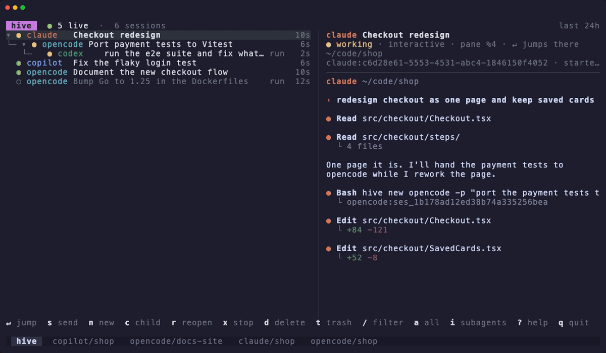

# hive

Track every coding-agent session (Claude Code, opencode, GitHub Copilot CLI, and Codex) as one tree:
who spawned whom, what each agent is doing right now, and a key press to jump into
or command any of them. Each agent runs its own real TUI in a tmux window; hive never
wraps or reimplements an agent.

How it works, and why: [DESIGN.md](DESIGN.md).

## Demo



A Claude session spawns an opencode agent, which runs a headless Codex exec; all
three show up as one tree. From there: watch each pane live, send one a message, jump
into it, or start a child of your own.

The agents in the demo are scripted stand-ins that report to hive the way the real
tools do, so recording it spends nothing; `docs/demo/record.sh` records it again
(it needs [vhs](https://github.com/charmbracelet/vhs)).

```sh
hive                 # the tree, in the current pane or a `hive` tmux session
```

With the keys bound (`hive install tmux`), **prefix + a** opens the tree over whatever
you're doing and closes once you jump somewhere, and **prefix + A** jumps straight to the
agent that needs you.

## Quick start

hive needs tmux, on macOS or Linux.

```sh
brew install SadriShehu/tap/hive    # or: go install github.com/sadrishehu/hive@latest
hive install                        # hooks for every agent on your PATH, and the tmux keys
hive                                # the tree
```

Every agent you start from then on shows up in the tree, however it was started: by
you, by another agent, or with `n` in the tree. Past sessions are imported too. `hive new
auto`, or tool `auto` in the tree's form, [picks the model](#picking-the-model-auto), and
the tool, for the prompt.

## Install

```sh
brew install SadriShehu/tap/hive               # macOS, with Homebrew
go install github.com/sadrishehu/hive@latest   # any OS with Go; or `go install .` in a checkout
hive install                                   # connect every agent found on PATH
```

`brew upgrade` brings hive along with everything else; for hive alone it is
`brew upgrade --cask hive`, because the plain name `hive` is Apache Hive in homebrew/core.

Prebuilt binaries for macOS and Linux are on the
[releases page](https://github.com/SadriShehu/hive/releases). `hive --version` shows
which build you run.

`hive install` adds hooks to `~/.claude/settings.json` (backed up to
`settings.json.bak-hive`), writes `~/.config/opencode/plugin/hive.js`, adds
`~/.copilot/hooks/hive.json` for Copilot CLI (or `$COPILOT_HOME/hooks/hive.json`,
backed up to `hive.json.bak-hive` when an existing file is changed), and adds hooks
to `~/.codex/hooks.json` for Codex (or `$CODEX_HOME/hooks.json`, backed up to
`hooks.json.bak-hive`). Codex asks you to trust the new hooks when it next starts.
It is safe to rerun; `hive uninstall` removes exactly what it added. Hooks load when
an agent starts, so running sessions pick them up after a restart; until then they
show as untracked, or are adopted as soon as they spawn another agent.

## The tree

Run `hive`. Inside tmux it opens in the current pane; outside tmux it attaches to a
tmux session called `hive`, with the tree in its first window. With the popup key
bound (`hive install tmux`), **prefix + a** opens the tree over whatever you're doing
and closes once you jump somewhere. The header counts the agents that need you.

```
 hive  ● 3 live  ·  203 sessions                                           last 24h
▾ ● claude   Admin phase 2                          2m │ claude Admin phase 2
├─   ● opencode admin-phase2-backend           run   1m │ ● working · interactive · pane %1 · ↵ jumps there
│  └─   ● opencode explore handlers            sub   1m │ ~/go/src/…/kudoesim
└─   ○ claude   lint fix                        run  30m │ ────────────────────────────────
                                                        │ › implement the backend plan
                                                        │   ⚙ Bash: go test ./...
                                                        │ All gates green.
```

The right side is live: the screen of the session's tmux pane, or the end of its
transcript for a headless run, a subagent or a finished session.

| Key | Does |
| --- | --- |
| `↵` | jump to the session's pane (a subagent: its parent's); reopen it if it isn't running |
| `s` | send a message: typed into its pane, or reopens it with the message |
| `n` / `c` | start an agent / start one as a child of the selected session; tool or model `auto` picks for the prompt |
| `r` | reopen a finished session in its tool's own TUI |
| `x` | stop it (asks first); a window hive opened closes with it |
| `d` | move it and everything under it to the trash (asks first) |
| `t` | the trash: `r` restores, `d` deletes for good, from its tool too (asks first) |
| `/` | filter by title, folder or ID, across all history |
| `a` · `i` · `←/→` | all history or last 24h · hide subagents · fold |
| `y` · `S` · `tab` · `?` | copy ID · sync now · hide preview · help |
| `u` | show / hide what the session used: model, tokens, price, context, tools, skills |

New agents open in a window of the current tmux session running the tool's real TUI,
linked under the selected session for `c`. The form asks for the tool, the model, the
folder and a first prompt. The model is the tool's own default unless you pick one of
the models it runs, or `auto`, which picks one for the prompt; tool `auto` picks the
tool too, or only the model inside one tool, as the form's mode says. Claude and
Copilot CLI are given their session IDs up front, so they are in the tree at once;
opencode shows as a new session until its first message, and Codex reports in as soon
as its TUI starts a thread.

## When an agent needs you

An agent needs you when it stops for a permission prompt or asks you a question (Claude
Code, opencode and Codex say so; Copilot CLI has no hook for it). hive lets you know
without the tree open:

- **A message in tmux**, on every client not already looking at that agent:
  `hive: claude ‹Admin phase 2› needs you · prefix A jumps there`.
- **prefix + A** goes to the agent that has needed you longest; press it again there
  for the next one. `hive jump --next` does the same from a shell.
- **A count in tmux's status line**, if you add it: `◆2 ●3 ◉1` for 2 that need you, 3
  working and 1 idle (nothing when no agent runs). `hive install tmux` prints the lines
  to add, with your current right side in them. With tmux's default right side:

  ```tmux
  set -g status-right-length 60
  set -g status-right '#{?window_bigger,[#{window_offset_x}#,#{window_offset_y}] ,}"#{=21:pane_title}" %H:%M %d-%b-%y #(hive status --tmux)'
  ```

  If you set `status-right` yourself, add `#(hive status --tmux)` to your own value.
  Avoid `set -ag`, which adds another copy each time tmux.conf is loaded. tmux runs the
  count every `status-interval` (15s unless set).
- **A desktop notification**, if you ask for one in the config file:

  ```toml
  # ~/.config/hive/config.toml
  [alerts]
  desktop = true   # osascript on macOS, notify-send on Linux
  tmux    = false  # to turn the tmux message off
  ```

## Use from the shell

```sh
hive ls           # trees with anything running or active in the last 24h
hive ls --all     # every session ever recorded
hive ls --live    # only running sessions and their ancestors
hive ls --json    # flat list in tree order, for scripts and agents
hive sync         # import history now (hive ls does this on its own); --full re-reads all
```

```
● claude        Admin phase 2                      working    2m  ~/go/src/…/kudoesim     claude:48873400
├─ ● opencode   admin-phase2-backend          run  working    1m  …/kudoesim/backend      opencode:ses_f18cd743
│  └─ ◉ claude  lint-fix                      run  idle       1m  …/kudoesim/backend      claude:0d683b5d
└─ ○ opencode   admin-phase2-app              run  exited    40m  …/kudoesim/admin        opencode:ses_f18cd367
```

● working · ◆ needs you · ◉ idle · ◌ running or untracked · ○ exited.
`run` marks a headless session, `sub` a tool's own subagent. Sessions a tool starts
ahead of use (Claude's daemon keeps spares ready for `claude --bg`) stay hidden until
their first message, and the daemon's own processes are never taken for sessions.

Every action in the tree is also a command, so an agent can start interactive
children, talk to them and check on them:

```sh
hive new opencode -p "port the tests" --wait   # start it in its own tmux window; prints its ID
hive new auto -p "fix the flaky sync test"     # pick the tool and the model for the prompt, then start
hive new claude --model auto -p "…"            # pick only the model, inside claude
hive wait <id>                                 # until it has answered: prints "<id> idle", "attention" or "exited"
hive send <id> "now run them"                  # type into it; an ended one reopens with the message
hive tail <id> -n 20                           # the end of its transcript (--json for agents)
hive usage <id>                                # model, tokens, price, tools, skills, context (--json)
hive models                                    # what each tool can run, with the ratings auto picks by
hive jump <id>                                 # go to its pane, reopening it if it has ended
hive jump --next                               # go to the agent that needs you
hive status                                    # one line: how many need you, work, are idle
hive resume <id> -p "carry on"                 # reopen an ended session in the background
hive kill <id>                                 # stop it; a window hive opened closes with it
hive rm <id>                                   # move it and everything under it to the trash
hive trash                                     # list the trash; then `restore <id>`, or `purge <id>` for good
hive doctor                                    # check tmux, the database and every agent's hooks
```

An `<id>` is the full ID (`claude:48873400-…`), the tool's own ID, or any unique
prefix of either. `hive new` starts in the current folder (`--cwd` to change it), in
the background (`--focus` to switch to it), linked under the agent running the command
(`--parent none` or `--parent <id>` to change that), with the tool's default model
(`--model <name>` to set one, as the tool names it; `--model auto` to pick one). `--wait` returns once the agent has
reported in, so a `hive send` right after it isn't typed before the agent can read it.
A tool that starts its session only with its first message (opencode without `-p`)
gets a stand-in ID, `opencode:pid-N`, which the other commands accept and which
names the session once it starts.

`hive wait <id>...` returns once each agent is done with what it was given: its turn
is over (idle), it stopped to ask you (attention), or it ended (exited). A message hive
gave it (`new -p`, `send`, `resume -p`) counts only once the agent has answered it, so
a `wait` straight after a `send` waits for the reply, not the turn before it. It prints
each session as it gets there; `--any` returns at the first, and `--timeout` gives up
(exit 1). A fan-out from inside an agent:

```sh
a=$(hive new claude -p "review the API" --wait)
b=$(hive new codex -p "review the UI" --wait)
hive wait "$a" "$b" && hive tail "$a" -n 5 && hive tail "$b" -n 5
```

An agent's shell tool may stop a long command (Claude Code's does after 2 minutes by
default), so a long wait wants a `--timeout` under that limit in a loop, or the
background.

### Deleting

Deleting goes in two steps. `d` in the tree, or `hive rm`, moves a session and every
session under it to the trash, once they have all ended: they leave the tree, history
imports leave them there, and each tool keeps its own copy. From the trash (`t` in the
tree, `hive trash`) a session comes back with everything under it, or is deleted for
good: from its tool, the way the tool deletes a session itself, and then from hive. That
can't be undone, so it asks first; with no terminal to ask on, `hive trash purge` needs
`--yes`, and `--all` empties the trash. A session in the trash comes back on its own if
its agent reports in again.

| Tool | Deleting for good removes |
| --- | --- |
| Claude Code | a background session through `claude rm` (which refuses while its worktree has unpushed work); then the transcript, its folder (subagents, tool output), and the session's `file-history`, `session-env` and `tasks`. The prompt history all sessions share (`history.jsonl`) keeps its lines |
| opencode | the session and its messages, through `opencode session delete` |
| Copilot CLI | its `session-state` folder, as Copilot's own delete does, and its rows in `session-store.db` (turns, files, search index, usage), which Copilot's delete leaves |
| Codex | the rollout and the thread's row in the state database, through `codex delete` |
| a tool from config | only hive's record |

## What a session used

hive reads each tool's own records for the model, the token counts, the price, the tools
and skills called, and how much of the context window is in use. `hive usage <id>`
prints it, `hive ls --json` carries it per row, and `hive ls` adds a `$` column and a
footer total when it has a price. `hive sync` reads what changed since the last sync,
a few KB for a running session.

```
model     claude-fable-5-1 · xhigh
requests  88
tokens    in 2312 · out 215708 · cache read 22468435 · cache write 767681
cost      $43.83 reported by claude
context   477989 of 1000000 (47%)
tools     Bash 41 · Read 22 · Edit 9 · Agent 3
skills    pr-comments 2 · /review 1
```

Where the numbers come from, per tool:

- **Claude Code** writes its exact cost into the transcript when the process exits. While
  a session runs, hive estimates the price from the token counts with built-in list prices
  for Claude models (marked `~`), and Claude's figure replaces it at exit. That figure covers
  the session's subagents and helper calls, so the subagents' own estimates never add to
  it. The context window is 200k, or 1M when the model is set with `[1m]` or a larger
  context was observed.
- **opencode** records the price and tokens per message; hive sums them.
- **Codex** records tokens and the context window, but no price. Add a `[[model]]` with
  prices to `config.toml` to see one.
- **Copilot CLI** records output tokens per message and the full totals, with premium
  requests, when a session ends; until then its numbers are marked partial.

```toml
# ~/.config/hive/config.toml
[[model]]                   # USD per million tokens; a built-in row with the same name is replaced
name           = "gpt-6-luna"
input          = 1.25
output         = 10
cache_read     = 0.125
cache_write    = 1.5
cache_write_1h = 2.5        # optional; cache_write applies to every write without it
context_window = 258400
tier           = "strong"   # how `hive new auto` rates it; see "Picking the model"
```

## Picking the model: auto

hive can choose the model for a new agent, and the tool too, the way Copilot's
HydraFusion chooses between its models: it reads the prompt for the kinds of work it
asks for and how hard it is, then starts the lightest model that meets that bar. An
easy task doesn't spend a frontier model; a hard one doesn't get a fast one. The pick
happens once, at launch; hive never changes a running agent's model.

You choose how far a pick may reach:

| Mode | What auto does | How to ask |
| --- | --- | --- |
| `provider` | picks the tool and the model: every installed tool's models compete | `hive new auto`, or tool `auto` in the form |
| `model` | picks only the model, inside one tool | `hive new <tool> --model auto`, or model `auto` in the form; `hive new auto --mode model` uses the configured tool, else the parent's, else the first installed |

```toml
# ~/.config/hive/config.toml
[fusion]
mode = "model"     # what `auto` means without --mode: "provider" (the default) or "model"
tool = "claude"    # the tool "model" mode picks inside; in "provider" mode, the tool that wins ties
```

`hive new … --dry-run` prints what would start and why, without starting it:

```
$ hive new auto -p "design the migration of every session to the new schema" --dry-run
claude claude-opus-5-5
claude · claude-opus-5-5: the lightest of 24 that meet reasoning 8, coding 8
  hard: design, every, migration
  reasoning: design, migration
  coding: schema
```

**What a prompt needs.** hive looks for four kinds of work: reasoning (design, plan,
review, security, performance…), coding (implement, add, refactor, write tests…),
debugging (fix, crash, flaky, root cause…) and tool use (run, deploy, commit, lint…).
Each kind found gets a level: 4 for a light task (typo, rename, quick…), 6 for a
routine one, 8 when it is hard (architecture, across, every, carefully…), and more
for a long prompt or one with three or more steps. A prompt with none of the cues
counts as routine coding. Without a prompt, the session is open-ended and asks for a
strong model on everything.

**What a model offers.** Every model hive knows has a tier, which rates it the same
on each kind of work and gives it a speed: `frontier` (10, speed 3), `strong` (8,
speed 5), `balanced` (6, speed 7) and `fast` (4, speed 10). Claude, GPT, Gemini,
DeepSeek and a few other families come rated; `hive models` shows them, and shows
which models of a tool are unrated. The pick takes the models that meet every level
the prompt asks for, and among them the lowest total rating, then the cheaper (when
both have a price), then the faster, then one from the preferred tool. When nothing
meets the bar, the closest to it wins, and `--dry-run` says so.

These are hive's starting ratings, not measurements. Change them, or rate a model
hive doesn't know, in `config.toml`; a rating set by hand replaces the tier's:

```toml
[[model]]
name      = "gpt-6-luna"
tier      = "strong"
debugging = 9          # reasoning, coding, debugging, tool_use, speed: 1 to 10
```

**What a tool can run.** hive asks each tool: opencode lists its models
(`opencode models`); Claude Code, Copilot CLI and Codex have the lists hive ships
with, plus every model their past sessions used, as the tool itself reported it. A
tool from config lists its models with `models = [...]` in its `[[agent]]` table,
which also replaces a built-in tool's list. Only a tool whose start command has a
`{model}` placeholder can be given a model; the built-in ones have it, and a `new`
you set in config needs it too.

## How linking works

Any agent can spawn any agent, in any direction; linking lives in hive's core, not in
the adapters. When a session first reports in, its parent is the first of:

1. the parent the event names (opencode's own subagents, Claude's `SubagentStart`);
2. the launch record hive made for the session's tmux pane;
3. the nearest ancestor process that is a live session;
4. `HIVE_PARENT`, exported by integrations that can pass it to their shell commands;
5. an adapter's own variable, such as `CLAUDE_CODE_SESSION_ID`.

Copilot CLI does not expose a session-ID environment file or child-shell export
hook, so its children use process ancestry when the parent is still running.

Codex runs its interactive sessions through a shared `codex app-server` daemon, and
its hooks run there, not under the TUI in your pane. hive never treats the daemon as
a session: when a Codex session reports in, hive finds its TUI through the window it
opened for it, or as the only Codex TUI in that folder; two Codex TUIs in one folder
stay apart until one of them ends. Codex exports `CODEX_THREAD_ID` to the commands
it runs, so what a Codex session spawns links to it even through the daemon. Codex's
own spawned agents are separate threads; they appear as subagents under the thread
that spawned them.

### Sessions from before hive

`hive sync` (run by `hive ls`) imports each tool's own history: Claude transcripts
(`~/.claude/projects`), opencode's database, Copilot CLI's session store
(`~/.copilot/session-store.db`, opened read-only) plus session-state event logs, and
Codex's rollouts (`~/.codex/sessions`) plus its state database (`~/.codex/state_*.sqlite`,
opened read-only) for thread names and spawned-agent links. Only what changed since
the last sync is read, so it takes milliseconds after the first run.

Past spawns are found in the shell commands every session ran, in any direction:
`opencode run --title X` inside Claude, `claude -p` inside opencode, `codex exec`
inside either, and so on. A command is matched to the session it started by title
first (loop titles like `review-p$i` match every run), then by start time and folder;
a command continuing a session by ID (`opencode run -s ses_…`, `codex resume <id>`)
only links sessions nothing else claims.

A running agent that never reported in (started before `hive install`) is matched to
its transcript when that is unambiguous: it is the only such process of its tool in
its folder, and exactly one session there was active since it started.

## Adding or changing a tool

A tool hive doesn't ship with is a few lines of config, and so is a change to a
built-in one:

```toml
# ~/.config/hive/config.toml ($XDG_CONFIG_HOME/hive/config.toml; HIVE_CONFIG overrides)
[[agent]]
name     = "aider"
new      = ["aider", "--message", "{prompt}"]
resume   = ["aider", "--restore-chat-history"]
headless = ["--message"]

[[agent]]  # a built-in tool: only the fields given change
name = "opencode"
new  = ["opencode", "--model", "{model}", "--prompt", "{prompt}"]
models = ["deepseek/deepseek-v4-pro", "deepseek/deepseek-flash"]
```

`new` and `resume` are the commands that start and reopen a session: `{prompt}` is the
first message, `{session}` an ID hive picks for it, `{id}` the session to reopen,
`{model}` the model to start with, and a flag right before an empty placeholder is
dropped with it. `process` names the tool's processes (by default, the program `new`
runs); `headless`, `title_flags`, `session_flags` and `parent_env` help link past
spawns, as in the built-in adapters; `models` lists the models the tool runs, for
`auto` to pick from. A new tool reports through `hive hook <name>`, below. The same
file holds `[alerts]` (above) and `[fusion]`. A config with mistakes is ignored, and
`hive doctor` says what is wrong with it.

## Any tool can report

```sh
echo '{"event":"start","session_id":"abc","pid":1234,"title":"refactor","cwd":"/src"}' \
  | hive hook mytool
```

Events: `start`, `prompt`, `busy`, `idle`, `attention`, `end`, `update`. Optional
fields: `parent_id` (`<tool>:<id>`), `internal`, `headless`, `at` (epoch ms). The same
fields work as flags: `hive hook mytool --event start --session abc`.

## Debugging

Hooks never print. Errors go to `~/.local/share/hive/hive.log`; set `HIVE_DEBUG=1` in
an agent's environment to log every linking decision. `HIVE_HOME` moves the database
and log elsewhere; `HIVE_TMUX_SOCKET=name` points hive at a named tmux server
(`tmux -L name`).

## Releases

Every push to `main` that passes CI and changes more than documentation becomes a
release: CI tags the next patch version, builds the binaries for macOS and Linux,
publishes the GitHub release, and updates the Homebrew cask. Put `#minor` or `#major`
in the first line of a commit message to bump that part instead; the rest of a message
can mention the tokens freely. To pick the bump by hand, run the CI workflow from the
Actions tab on `main`.

## Feedback

Bugs, ideas and requests for other agents go in
[issues](https://github.com/SadriShehu/hive/issues/new/choose). For a bug, the output of
`hive --version` and `hive doctor` says most of what's needed.

## License

MIT — see [LICENSE](LICENSE).
